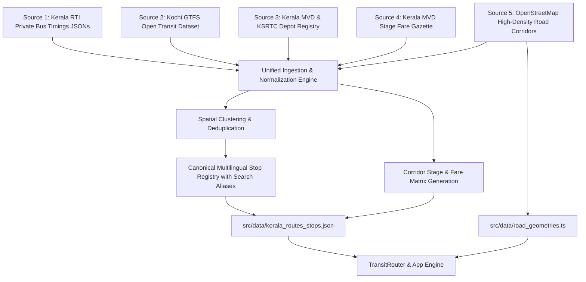

# Wiyo Journeys • വയ്യോ ജേർണീസ് 🚌
> **Kerala Multilingual Route & Fare Assistant**  
> *ANAVANDI FutureBuild 2026 • Problem Statement PS-02*  
> **Tagline:** *Your journey, made simple.*

[](https://wiyo-journeys.vercel.app)
[](https://www.typescriptlang.org/)
[](https://vitejs.dev/)
[](https://tailwindcss.com/)
[](https://leafletjs.com/)

---

## 🌟 Overview

**Wiyo Journeys** is an ultra-fast, 100% offline-capable Progressive Web Application (PWA) designed for Kerala public transit commuters. It provides seamless transit navigation, official Kerala Motor Vehicles Department (MVD) statutory stage fare calculations, spoken multilingual audio assistance, and real-time live journey progression with zero login barriers.

🌐 **Live Demo:** [https://wiyo-journeys.vercel.app](https://wiyo-journeys.vercel.app)

---

## ✨ Key Features

### 1. 🌐 4-Language Multilingual Support (Strict Language Isolation)
* Full support across **English**, **Malayalam (`മലയാളം`)**, **Tamil (`தமிழ்`)**, and **Hindi (`हिंदी`)**.
* Every screen strictly adheres to the selected language without mixed-language leakage.

### 2. 📴 100% Offline Core Architecture
* **Deterministic Stage Fare Calculation:** Computes exact Kerala MVD statutory stage tariffs (Ordinary, City Fast, Fast Passenger, Super Fast) on-device without cloud API dependencies.
* **Offline Route Graph Engine:** Search stops, routes, and connections instantly in <2 ms from local in-memory datasets.
* **Pre-cached Phrase Audio & Resilient Tile Layer:** Leaflet map features dark schematic canvas fallback with SVG blueprint grid when connection drops.

### 3. 🎙️ Multilingual Voice & Speech Assistant
* **Speech-to-Text (STT):** Spoken destination searches with phonetic transliteration for South Indian place names.
* **Text-to-Speech (TTS):** Dynamic voice synthesis announcing route numbers, boarding stops, alighting landmarks, and estimated fares.

### 4. 🧭 Nearest Reachable Stop Fallback (Geometric Routing)
* If no direct bus exists between the passenger's boarding stop and requested destination, the engine calculates the **closest reachable stop** using offline Haversine distance.
* Displays a clear fallback banner with remaining walking/auto transfer distance (in km) and 8-point localized compass bearing (*e.g., "Alight at Palarivattom; destination is 6.2 km East"*).

### 5. 🗺️ Live Real-Time Road-Snapped Journey Tracking & Alerts
* Real-time GPS simulation and live tracking following exact road contours and curves.
* **Whichever Comes First Alert Rule:** Alight alarm triggers when vehicle is within $\le 250\text{m}$ OR $\le 30\text{s}$ ETA, with exact-once per stop deduplication.
* **GPS Jitter & Detour Tolerance:** Automatic $75\text{m}$ road-snap radius with graceful raw GPS fallback during route detours.
* Interactive Leaflet map with dark/light mode tile compatibility and schematic linear progress nodes.

---

## 📊 Heterogeneous Multi-Source Transit Datasets

Wiyo Journeys synthesizes and cross-references data from multiple authoritative public transit and geographic datasets:



### 1. Kerala RTI Bus Timing Dataset (`Kerala-Private-Bus-Timing`)
* **Source:** Official Right to Information (RTI) private bus schedules compiled across Kerala districts (`ernakulam.json`, `attingal.json`, `alappuzha.json`, `kottayam.json`, `thrissur.json`, `kozhikode.json`, `palakkad.json`).
* **Contribution:** Real-world trip timings, first/last bus departures, departure intervals, and regional stop names.

### 2. Kochi GTFS Open Transit Feed (`KochiTransport/`)
* **Source:** High-precision GTFS transit feed (`stops.txt`, `routes.txt`, `trips.txt`, `stop_times.txt`, `frequencies.txt`).
* **Contribution:** **3,258 surveyed WGS84 GPS bus stops**, 475 transit routes, and verified transfer hubs across the Greater Kochi Metro corridor.

### 3. Kerala MVD & KSRTC Depot Infrastructure (`Tvmtransport/`)
* **Source:** Official Kerala State Road Transport Corporation (KSRTC) depot and terminal registry.
* **Contribution:** Inter-district hub connectivity (Thampanoor Central, Attingal, Vyttila Mobility Hub, Thrissur Sakthan, Kottayam KSRTC, Angamaly, Aluva Terminal).

### 4. Kerala MVD Statutory Stage Carriage Fare Gazette
* **Source:** Government of Kerala Motor Vehicles Department (MVD) Stage Carriage Fare Notifications.
* **Contribution:** Deterministic stage fare matrices for **Ordinary**, **City Fast**, **Fast Passenger**, and **Super Fast** services with dual-check sanity checks against straight-line and route distance.

### 5. High-Density Road Geometries (`src/data/road_geometries.ts`)
* **Source:** OpenStreetMap surveyed road waypoints and OSRM highway graphs.
* **Contribution:** Road-following geometries for major Kerala corridors (MG Road Metro Line, NH 66 Coastal Bypass, NH 544 Express Corridor to Thrissur, Goshree Islands, Fort Kochi, Infopark Kakkanad, Kottayam SH 15).

---

## 🛠️ Technology Stack

| Layer | Technology | Rationale |
|---|---|---|
| **Language** | [TypeScript](https://www.typescriptlang.org/) | Strict type safety, deterministic routing logic, zero runtime type errors. |
| **Bundler & Server** | [Vite](https://vitejs.dev/) | Instant HMR, ultra-lightweight production bundle (<128 KB). |
| **Styling & Theme** | [Tailwind CSS](https://tailwindcss.com/) | High-contrast accessible transit colors, dark mode tokens, fluid animations. |
| **Maps & GIS** | [Leaflet.js](https://leafletjs.com/) + OpenStreetMap | Lightweight open-source mapping with vector overlays and offline tile fallback. |
| **Speech Engine** | [Web Speech API](https://developer.mozilla.org/en-US/docs/Web/API/Web_Speech_API) | Low-latency on-device speech recognition & voice synthesis. |
| **Storage & Data** | In-Memory JSON + LocalStorage | Instantaneous zero-latency querying, 100% offline capability. |
| **Deployment** | [Vercel](https://vercel.com/) | Continuous deployment with global CDN edge caching. |

---

## 🚀 Getting Started

### Prerequisites
* [Node.js](https://nodejs.org/) (v18 or higher recommended)
* [npm](https://www.npmjs.com/)

### Installation & Run

1. **Clone the repository:**
   ```bash
   git clone https://github.com/Abhinav-Abhilash/Wiyo-Journeys.git
   cd Wiyo-Journeys
   ```

2. **Install dependencies:**
   ```bash
   npm install
   ```

3. **Run Dataset Ingestion & Unification Pipeline (Optional):**
   ```bash
   node scripts/build_unified_dataset.mjs
   ```

4. **Run End-to-End Route Accuracy & Polyline Verification Tests:**
   ```bash
   npm test
   ```

5. **Start local development server:**
   ```bash
   npm run dev
   ```
   Open `http://localhost:5173` in your browser.

6. **Build for production:**
   ```bash
   npm run build
   ```

---

## 📁 Project Structure

```
Wiyo-Journeys/
├── KochiTransport/             # GTFS Open Transit Dataset (3,258 stops, routes, schedules)
├── Tvmtransport/               # Kerala MVD & KSRTC depot and hub infrastructure
├── public/                     # Static assets, branding logos, icons
├── scripts/
│   ├── build_unified_dataset.mjs    # Multi-source dataset ingestion & unification pipeline
│   ├── verify_e2e_route_tracing.mjs # E2E route finding, stop sequence & map tracing tests
│   └── sarvam-tts-prep.ts           # Optional Indic TTS phrase preparation
├── src/
│   ├── core/                   # Deterministic Core Engines
│   │   ├── fare-calculator.ts  # Official Kerala MVD Stage Fare Calculator
│   │   ├── geo.ts              # Haversine distance, road-snapping & JourneyTracker
│   │   ├── routing.ts          # TransitRouter, direct paths & nearest-stop fallback
│   │   ├── matcher.ts          # Indic multilingual phonetic fuzzy search & alias index
│   │   ├── voice-in.ts         # Speech-to-Text with Indic voice command triggers
│   │   ├── voice-out.ts        # Multilingual voice synthesis & audio queues
│   │   ├── notification.ts     # In-app toast and Web Notification manager
│   │   ├── storage.ts          # Offline local storage & saved journey cards
│   │   └── degradation.ts      # Offline/online capability & sensor detection
│   ├── data/                   # Datasets
│   │   ├── kerala_routes_stops.json # Unified multilingual stops, routes, stages & timetables
│   │   └── road_geometries.ts  # Road polyline GPS coordinates & corridor spline engine
│   ├── app.ts                  # Main SPA controller, DOM wiring & Leaflet map manager
│   ├── index.ts                # Core SDK exports & singletons
│   └── types.ts                # TypeScript interfaces & domain models
├── index.html                  # Main SPA markup & 4-screen viewports
├── package.json
├── tsconfig.json
├── vite.config.ts
└── README.md
```

---

## 👥 Authors & Acknowledgements
* Developed for **ANAVANDI FutureBuild 2026** (Hackathon Problem Statement PS-02).
* Built with ❤️ for Kerala bus commuters.
